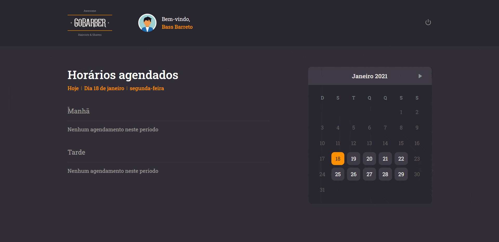
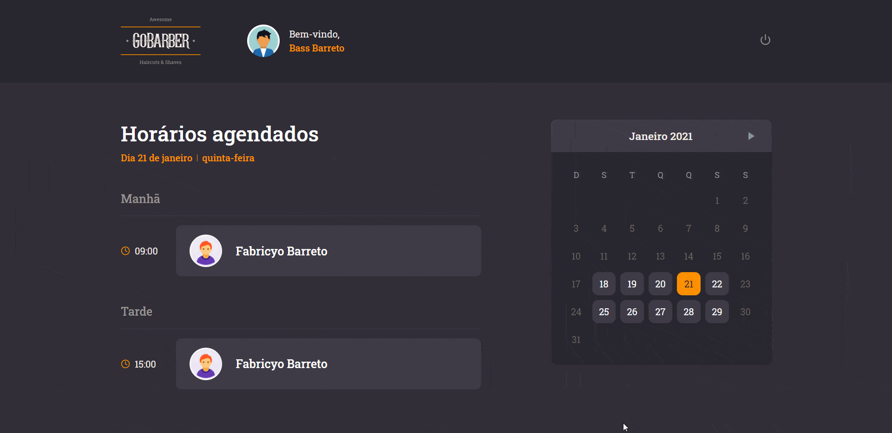

<h1 align="center">
 
  
 
 
GoBarber
</h1>

Um sistema web de agendamento para barbeiros

  

[//]: # (Add your gifs/images here:)

   
  

## Features
[//]: # (Add the features of your project here:)
Nessa aplicação foram utilizados as seguintes tecnologias abaixo:

- **React Js** — Uma biblioteca para construção de interfaces web
- **Styled Components** - Um pacote que auxilia nas estilizações das páginas, permite escrever código CSS em arquivos javascript

## Getting started

Primeiro faça o clone do repositório:  
    `git clone {url repositório}`   
Entre na pasta do projeto:  
    `cd gobarber-frontend`   
Precisa alterar as variaveis de ambiente para apontar para a API, seguindo o arquivo de exemplo:  
    `.env.example`   
A API está em outro repositorio nessa conta chamado:  
    `gobarber-backend`   
Execute o comando para baixar os pacotes:  
    `yarn` ou `npm`   
Agora inicie o projeto:  
    `yarn start` ou `npm start`   

## License

This project is licensed under the MIT License - see the [LICENSE](https://opensource.org/licenses/MIT) page for details.
